# Architecture — étape "Socket Test" (jalon minimal)

> Objectif de ce jalon : valider la stack réseau de bout en bout.
> 2 joueurs sur 2 PC différents rejoignent une même partie, voient chacun un cube,
> peuvent se déplacer (WASD) et sauter (Space) sur une flat map.
> **Aucune logique de gameplay** (ennemis, armes, XP) à ce stade.

## Stack

| Couche | Techno | Pourquoi |
|---|---|---|
| Front 3D | **Babylon.js** + Vite + TypeScript | Choisi pour le projet ; bonne intégration WebGL/WebGPU. |
| Transport temps réel | **Colyseus** (WebSocket + state sync) | Schémas synchronisés serveur→clients, gestion de rooms native. |
| Runtime serveur | **Bun** | Plus rapide que Node, TypeScript natif. |
| Code partagé | `shared-package` (TypeScript) | Types `InputCommand`, noms de messages — un seul contrat pour les 2 côtés. |
| Config | **JSON data-driven**, chargés **1× au démarrage** | Permet de tweaker les paramètres de gameplay sans recompiler. |

## Principes d'architecture

1. **Serveur autoritaire.** Le client n'écrit jamais sa propre position. Il envoie un `InputCommand`, le serveur tick (`MovementSystem` → `PhysicsSystem`) → mute `GameState`, Colyseus broadcast les diffs.
2. **Modulaire.** Un dossier = une responsabilité. Ajouter "tir" plus tard = nouveau `WeaponSystem` côté serveur + nouveau message dans `shared`. Aucun module n'a besoin d'être réécrit.
3. **Data-driven.** Aucune constante de gameplay en dur. Tout (`gravity`, `jumpForce`, `moveSpeed`, `maxPlayers`, `tickRate`, key bindings) vit dans des fichiers JSON sous `data/`.
4. **Contrat partagé.** Les noms de messages et les DTOs sont définis une seule fois dans `shared-package`, importés client et serveur — impossible de diverger.
5. **Documentation.** Toute fonction/classe publique exposée par un module doit avoir un bloc TSDoc.

## Diagramme

```mermaid
flowchart LR
    %% ============================================================
    %%  CLIENT  (apps/game/client)  —  Babylon.js
    %% ============================================================
    subgraph CLIENT["🎮 CLIENT — apps/game/client (Babylon.js + Vite)"]
        direction TB

        subgraph C_BOOT["bootstrap"]
            C_MAIN["main.ts<br/><i>entry point</i>"]
            C_CFG["core/ConfigLoader.ts<br/><i>charge les JSON 1× au démarrage</i>"]
        end

        subgraph C_CORE["core/"]
            C_ENGINE["Engine.ts<br/><i>Babylon Engine + canvas + setScene()</i>"]
        end

        subgraph C_SCENES["scenes/"]
            C_GAMESCENE["GameScene.ts<br/><i>flat map, lumières, ArcRotateCamera</i>"]
        end

        subgraph C_ENTITIES["entities/"]
            C_PLAYER["PlayerEntity.ts<br/><i>1 cube = 1 joueur</i>"]
            C_REGISTRY["PlayerRegistry.ts<br/><i>map id → PlayerEntity (add/remove)</i>"]
        end

        subgraph C_INPUT["input/"]
            C_INPUTMGR["InputManager.ts<br/><i>WASD + Space → InputCommand</i>"]
        end

        subgraph C_NET["network/"]
            C_CLIENT["NetworkClient.ts<br/><i>wrapper Colyseus.Client</i>"]
            C_ROOM["RoomHandler.ts<br/><i>onStateChange → registry</i>"]
            C_LAT["LatencyMonitor.ts<br/><i>send Ping @ Nhz, mesure RTT + jitter</i>"]
        end

        subgraph C_UI["ui/"]
            C_HUD["StatsHud.ts<br/><i>Babylon GUI : ping, jitter, FPS,<br/>frame, players, tickRate</i>"]
        end

        subgraph C_DATA["data/ (JSON statiques)"]
            C_J1["controls.json"]
            C_J2["render.json<br/><i>+ hud.colors, hud.thresholds</i>"]
            C_J3["network.json<br/><i>endpoint, sendRate, pingInterval, window</i>"]
        end

        C_MAIN --> C_CFG --> C_ENGINE --> C_GAMESCENE
        C_GAMESCENE --> C_REGISTRY --> C_PLAYER
        C_INPUTMGR --> C_CLIENT
        C_CLIENT --> C_ROOM --> C_REGISTRY
        C_CLIENT --> C_LAT
        C_LAT -. snapshot .-> C_HUD
        C_GAMESCENE -. mount .-> C_HUD
        C_CFG -. lit .-> C_J1 & C_J2 & C_J3
    end

    %% ============================================================
    %%  SHARED  (apps/game/shared-package)
    %% ============================================================
    subgraph SHARED["📦 SHARED — apps/game/shared-package"]
        S_PROTO["protocol.ts<br/><i>ROOM_NAME, ClientMessage {Input, Ping},<br/>ServerMessage {Pong}</i>"]
        S_MSGS["types/messages.ts<br/><i>InputCommand, PingPayload</i>"]
        S_STATEV["types/state.ts<br/><i>PlayerStateView, GameStateView</i>"]
    end

    %% ============================================================
    %%  TRANSPORT
    %% ============================================================
    WS{{"🔌 WebSocket / Colyseus protocol<br/><b>State sync</b> (server → clients)<br/><b>Inputs</b> + <b>Ping</b> (client → server)<br/><b>Pong</b> (server → 1 client)"}}

    %% ============================================================
    %%  SERVER  (apps/game/server)  —  Bun + Colyseus
    %% ============================================================
    subgraph SERVER["🧠 SERVER — apps/game/server (Bun + Colyseus) — AUTORITAIRE"]
        direction TB

        subgraph S_BOOT["bootstrap"]
            S_INDEX["index.ts<br/><i>Bun entry</i>"]
            S_CFG["core/ConfigLoader.ts<br/><i>charge les JSON 1× au démarrage</i>"]
        end

        subgraph S_CORE["core/"]
            S_SERVER["Server.ts<br/><i>Colyseus + WebSocket transport</i>"]
        end

        subgraph S_ROOMS["rooms/"]
            S_ROOM["GameRoom.ts<br/><i>onCreate / onJoin / onLeave<br/>onMessage(Input) / onMessage(Ping) → echo Pong<br/>setSimulationInterval</i>"]
        end

        subgraph S_SCHEMAS["schemas/ (Colyseus @type)"]
            S_STATE["GameState.ts<br/><i>MapSchema&lt;Player&gt; + serverTickRateHz</i>"]
            S_PLAYERSCH["Player.ts<br/><i>id, x/y/z, vx/vy/vz, isGrounded</i>"]
        end

        subgraph S_SYSTEMS["systems/ (game loop tick)"]
            S_MOVE["MovementSystem.ts<br/><i>applique inputs → velocity</i>"]
            S_PHYS["PhysicsSystem.ts<br/><i>gravité, sol, saut</i>"]
        end

        subgraph S_DATA["data/ (JSON statiques)"]
            S_J1["physics.json<br/><i>gravity, jumpForce, moveSpeed</i>"]
            S_J2["room.json<br/><i>maxPlayers=2, tickRate, mapSize</i>"]
        end

        S_INDEX --> S_CFG --> S_SERVER --> S_ROOM
        S_ROOM --> S_STATE --> S_PLAYERSCH
        S_ROOM -- "tick" --> S_MOVE --> S_PHYS --> S_STATE
        S_CFG -. lit .-> S_J1 & S_J2
    end

    %% ============================================================
    %%  Flux réseau
    %% ============================================================
    C_CLIENT == "InputCommand (move/jump)" ==> WS
    WS == "InputCommand" ==> S_ROOM
    S_STATE == "patch state" ==> WS
    WS == "state diff" ==> C_ROOM
    C_LAT == "Ping {clientTime}" ==> WS
    WS == "Ping" ==> S_ROOM
    S_ROOM == "Pong {clientTime}" ==> WS
    WS == "Pong" ==> C_LAT

    %% Shared utilisé des deux côtés
    SHARED -. import .-> C_NET
    SHARED -. import .-> C_HUD
    SHARED -. import .-> S_ROOM

    %% Styles
    classDef data fill:#fef3c7,stroke:#d97706,color:#78350f
    classDef net fill:#dbeafe,stroke:#2563eb,color:#1e3a8a
    classDef shared fill:#ede9fe,stroke:#7c3aed,color:#4c1d95
    classDef hud fill:#fce7f3,stroke:#db2777,color:#831843
    class C_J1,C_J2,C_J3,S_J1,S_J2 data
    class WS,C_CLIENT,C_ROOM,C_LAT,S_SERVER,S_ROOM net
    class S_MSGS,S_PROTO,S_STATEV shared
    class C_HUD hud
```



## Découpage des modules

### Serveur — `apps/game/server`

```
src/
├── index.ts                       # Bun entry — bootstrap
├── core/
│   ├── Server.ts                  # Crée le Colyseus.Server, enregistre les rooms
│   └── ConfigLoader.ts            # Lit data/*.json 1× au démarrage, expose un Config typé
├── rooms/
│   └── GameRoom.ts                # onCreate / onJoin / onLeave / onMessage("input") / tick
├── schemas/
│   ├── GameState.ts               # @type — MapSchema<Player>
│   └── Player.ts                  # @type — id, x, y, z, vx, vy, vz, isGrounded
├── systems/
│   ├── MovementSystem.ts          # input → velocity
│   └── PhysicsSystem.ts           # gravité, collision sol, saut
└── data/
    ├── physics.json               # { gravity, jumpForce, moveSpeed }
    └── room.json                  # { maxPlayers: 2, tickRate: 30, mapSize }
```

### Client — `apps/game/client`

```
src/
├── main.ts                        # Entry — bootstrap (compose tout le graphe)
├── core/
│   ├── Engine.ts                  # Babylon Engine + canvas + setScene()
│   └── ConfigLoader.ts            # Lit data/*.json 1× au démarrage
├── scenes/
│   └── GameScene.ts               # Flat map, lumières, ArcRotateCamera
├── entities/
│   ├── PlayerEntity.ts            # 1 cube Babylon = 1 joueur
│   └── PlayerRegistry.ts          # Map id → PlayerEntity (add/remove sur state diff)
├── input/
│   └── InputManager.ts            # Capture WASD + Space → produit InputCommand
├── network/
│   ├── NetworkClient.ts           # Wrapper Colyseus.Client (connect, joinOrCreate)
│   ├── RoomHandler.ts             # onStateChange → met à jour le PlayerRegistry
│   └── LatencyMonitor.ts          # send Ping périodique, mesure RTT + jitter
├── ui/
│   └── StatsHud.ts                # Babylon GUI : ping/jitter/FPS/frame/players/tickRate
└── data/
    ├── controls.json              # Key bindings (KeyboardEvent.code)
    ├── render.json                # Camera, sol, couleurs joueur, hud.colors + hud.thresholds
    └── network.json               # endpoint, sendRateHz, pingIntervalMs, pingWindowSize
```

### Shared — `apps/game/shared-package`

```
src/
├── index.ts                       # Barrel public (re-exports protocol + types)
├── protocol.ts                    # ROOM_NAME, ClientMessage {Input, Ping}, ServerMessage {Pong}
└── types/
    ├── index.ts                   # Barrel types
    ├── messages.ts                # InputCommand, PingPayload
    └── state.ts                   # PlayerStateView, GameStateView (read-only mirrors)
```

## Flux réseau (résumé)

### Boucle principale — gameplay
1. Client se connecte : `Colyseus.Client.joinOrCreate(ROOM_NAME)`.
2. Serveur instancie `GameRoom` si elle n'existe pas, ajoute un `Player` au `GameState`.
3. Colyseus diff-broadcast : tous les clients reçoivent l'ajout du `Player` → `PlayerRegistry.add()` → un cube apparaît.
4. Toutes les `1/sendRateHz` s côté client, `RoomHandler` lit `InputManager.snapshot()` → `room.send(Input, InputCommand)`.
5. À chaque tick serveur (`1/tickRate` s), `GameRoom` applique `MovementSystem` puis `PhysicsSystem` sur le `GameState`.
6. Colyseus broadcast les diffs → callbacks client → `RoomHandler` met à jour les positions via le `PlayerRegistry`.

### Boucle secondaire — latence (orthogonale au gameplay)
1. Toutes les `pingIntervalMs` côté client, `LatencyMonitor` envoie `room.send(Ping, { clientTime: performance.now() })`.
2. Serveur reçoit `Ping`, **echoe le payload tel quel** via `client.send(Pong, msg)` — 0 mutation d'état, pas de system, pas de tick.
3. Client reçoit `Pong` → `RTT = performance.now() - msg.clientTime` → mis dans la fenêtre glissante de N samples → calcule `jitter = stdDev(window)`.
4. À chaque frame Babylon, `StatsHud` lit `LatencyMonitor.stats` + `engine.getFps()` + `room.state.players.size` + `room.state.serverTickRateHz` via un `StatsProvider` injecté → met à jour les TextBlock GUI avec coloration vert/jaune/rouge selon seuils JSON.

## Système latence — pourquoi cette archi

Le système de mesure de ping est **complètement orthogonal** au gameplay :
- **Côté serveur** : 1 ligne (`onMessage(Ping, (c, m) => c.send(Pong, m))`), aucun system, aucune mutation d'état. Le serveur n'est pas conscient de la métrique — il rend juste un service d'echo.
- **Côté shared** : 1 message en plus dans chaque direction (`Ping`, `Pong`), 1 payload (`PingPayload { clientTime }`). Single source of truth, comme tout le reste.
- **Côté client** : 2 nouveaux modules indépendants — `LatencyMonitor` (logique réseau) et `StatsHud` (vue Babylon GUI), reliés par une **interface `StatsProvider`** que `main.ts` compose. Ni l'un ni l'autre ne connaît la classe concrète de l'autre.

**Bénéfices** :
- Ajouter le **packet loss** demain = ajouter un compteur dans `LatencyMonitor`, ajouter une ligne dans la snapshot, ajouter un row dans `StatsHud`. Le serveur n'est pas touché.
- Désactiver le HUD pour un mode "tournoi" = ne pas construire `StatsHud` dans `main.ts`. Le reste fonctionne identiquement.
- Le HUD peut être remplacé par une intégration **Telemetry → Prometheus** sans rien changer à `LatencyMonitor` — c'est un autre consommateur de `StatsProvider`.

## Critères de succès du jalon

- [ ] 2 navigateurs sur 2 PC différents rejoignent la même room.
- [ ] Chaque joueur voit son propre cube **et** celui de l'autre joueur.
- [ ] WASD déplace le cube, Space le fait sauter (gravité + retombe).
- [ ] Si l'un se déconnecte, son cube disparaît côté l'autre.
- [ ] Tous les paramètres (vitesse, saut, gravité, tickRate, seuils HUD, intervalle ping) sont modifiables en éditant un JSON, sans recompiler.
- [ ] Le HUD affiche un ping réaliste (~1-5 ms en localhost, vert), jitter < 2 ms, FPS ≥ 55, players=2, server=30 Hz.
